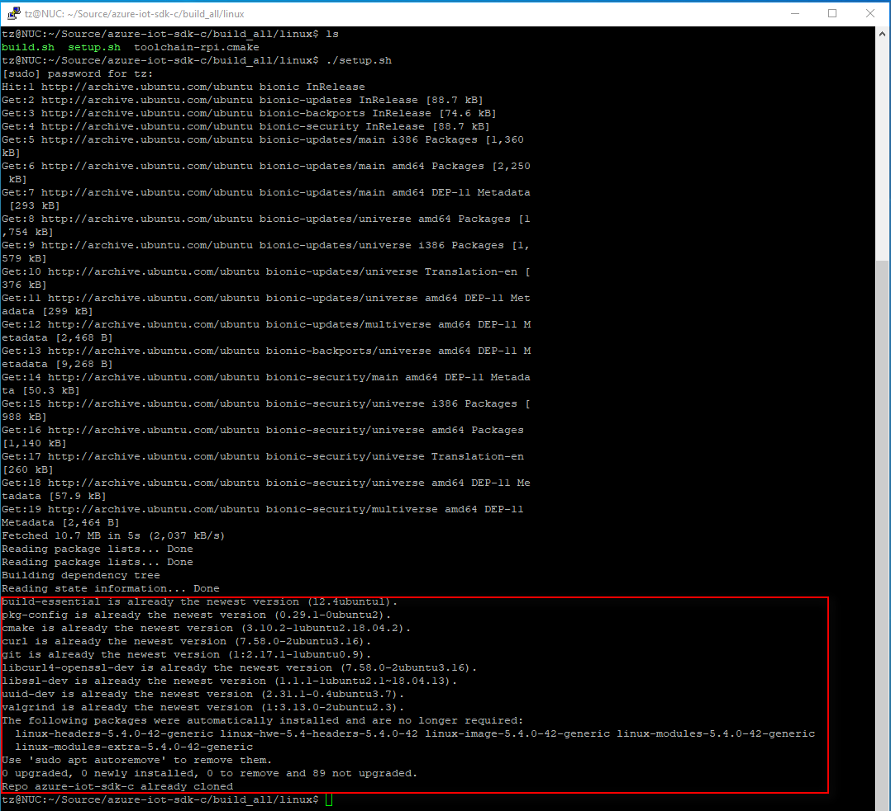
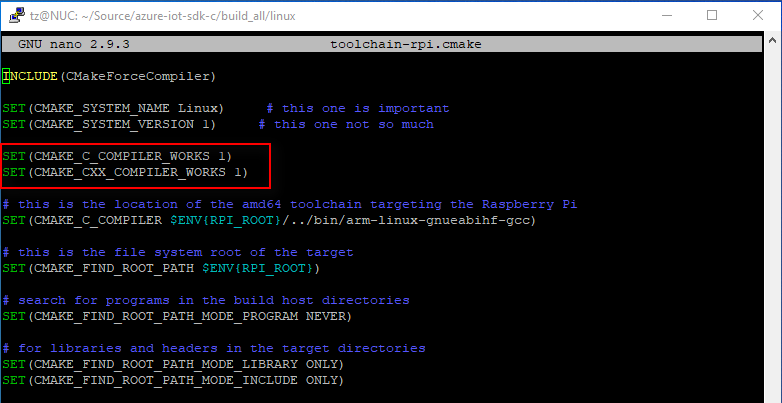
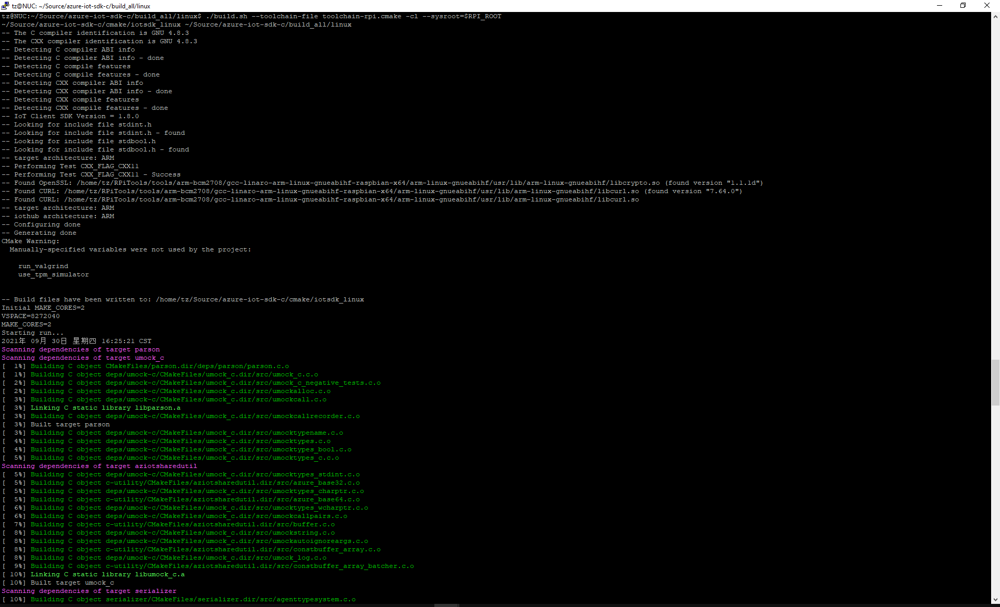
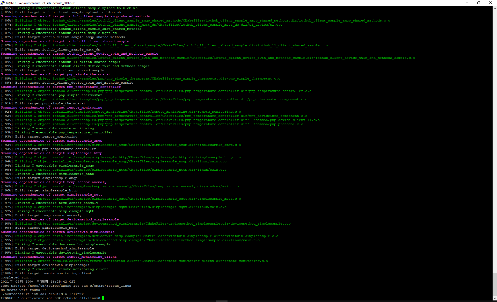

# Cross compile Azure IoT C SDK on Ubuntu 1804 LTS targeting an ARM device

## Background 

To run the Azure IoT SDK C on an arm device, normally cross compiling is required. There is a [guide](https://github.com/Azure/azure-iot-sdk-c/blob/master/doc/SDK_cross_compile_example.md) provided to help cross compile the Azure IoT Hub SDK on Github. 

However, this guide was composed three years ago and seems to be outdated for reference. You `cannot` cross compile the Azure IoT C SDK successfully based on it. Per my testing, I found below issue:
- The host machine used in the guide was running `Debian 8 (jessie)` and the target device was running `Raspbian 8 (jessie)` too. Both platforms are outdated.
- Some commands cannot execute correctly. For example: `rsync -rl …`
- The necessary libraries are not clearly specified.
- The sample toolchain.cmake file doesn’t work.

This cross-compiling guide work as a complete guide for latest platform and target device and fixed and/or avoided above problems.

## Pre-requisites

- Host Machine:
  - Hardware: `Intel NUC` (You may use any ARM64 PC)
  - OS: [Ubuntu 18.04.6 LTS (Bionic Beaver)](http://releases.ubuntu.com/18.04/ubuntu-18.04.6-desktop-amd64.iso)
    
- Target device:
  - Hardware: `Raspberry Pi 4B`
  - OS: [Raspberry Pi OS Lite v5.10](https://downloads.raspberrypi.org/raspios_lite_armhf/images/raspios_lite_armhf-2021-05-28/2021-05-07-raspios-buster-armhf-lite.zip)

- Azure IoT SDK C: 
  - Release [v1.8.0](https://github.com/Azure/azure-iot-sdk-c/releases)


## Step 1: Set up target device

The target device we choose is Raspberry Pi 4B, which is probaly one of the most popular arm-based dev boards on this planet. 


1. Login to your Raspberry Pi 4. The default user is `pi`.
2. Clone the latest Azure IoT C SDK to local.

```
cd ~
git clone https://github.com/Azure/azure-iot-sdk-c.git
cd azure-iot-sdk-c/build_all/linux/
./setup.sh
```
3. Activate root user.
    

Now, you are ready on the Raspberry Pi. Keep it running as we will need to copy some files from Raspberry Pi to the host PC.


## Step 2: Setting up the Ubuntu development environment

This section describes how to set up a development environment for Azure IoT C SDK on Ubuntu 18.04.

1. Install Ubuntu 18.04.6 LTS on your Intel NUC.
2. Install all the necessary dependences. You may use `apt-get` to install them.

```
sudo apt-get update
sudo apt-get install -y git cmake build-essential curl libcurl4-openssl-dev libssl-dev uuid-dev ca-certificates
```

3. Clone the latest Azure IoT C SDK to your Ubuntu. 
   
```
cd ~
mkdir Source
git clone https://github.com/Azure/azure-iot-sdk-c.git
cd azure-iot-sdk-c
git submodule update --init
```

4. Once the Azure IoT SDK is cloned, you may check if all the dependencies are in place by running below setup script.
   ```
cd ~/Source/azure-iot-sdk-c/build_all/linux/
./setup.sh
```

You may see the `build-sessential, pkg-config, cmkae, curl, git, libcurl4-openssl-dev, libssl-dev, uuid-dev, valgrind` are already the newest version, and also the `repo azure-iot-sdk-c` is laready cloned.

    


Btw, this guide is about cross-compiling the Azure IoT SDK for arm device. If you want to build the C SDK on amd64 Linux, you can follow below to do that. 

```
# This part is OPTIONAL.

cd ~/Source/azure-iot-sdk-c/
mkdir cmake
cd cmake
cmake ..
cmake --build .
```

5. Download the required toolchain, system libraries and system headers for cross compiling. 

```
cd ~
mkdir RPiTools
cd RPiTools
git clone https://github.com/raspberrypi/tools.git
    ```
Please be noted that these tools don't give you all the files required to build the project. Therefore, you will need to copy the files from Raspberry Pi to the host machine.

6. Copy required files from Raspberry Pi to the host machine.

```
cd ~/RPiTools/tools/arm-bcm2708/gcc-linaro-arm-linux-gnueabihf-raspbian-x64/arm-linux-gnueabihf
scp pi@{your-RPi-IP}:/usr/ .

cd lib
mkdir arm-linux-gnueabihf
cd arm-linux-gnueabihf
scp pi@{your-RPi-IP}:/lib/arm-linux-gnueabihf/ld-linux-armhf.so.3 ./lib/
scp pi@{your-RPi-IP}:/lib/arm-linux-gnueabihf/libc.so.6 ./lib/
```

7. Set up cmake to cross compile.
   
In order to tell cmake that it is performing a cross compile we need to provide it with a toolchain file. To save us some typing and to make our whole procedure less dependent upon the current user we are going to export a value. 

```
cd ~/RPiTools/tools/arm-bcm2708/gcc-linaro-arm-linux-gnueabihf-raspbian-x64/arm-linux-gnueabihf
export RPI_ROOT=$(pwd)
```

You may use command `echo` to verify if the environment variable is added successfully.

```
echo $RPI_ROOT
```

Now, you may start to create a cmake file.

```
cd ~/Source/azure-iot-sdk-c/build_all/linux/
nano toolchain-rpi.cmake
```

You may use any text editors, like `nano` or `vi`, that works the best for me. I am used to using `nano` editor here. Just add below script:

```
INCLUDE(CMakeForceCompiler)

SET(CMAKE_SYSTEM_NAME Linux)     # this one is important
SET(CMAKE_SYSTEM_VERSION 1)     # this one not so much

SET(CMAKE_C_COMPILER_WORKS 1)
SET(CMAKE_CXX_COMPILER_WORKS 1)

# this is the location of the amd64 toolchain targeting the Raspberry Pi
SET(CMAKE_C_COMPILER $ENV{RPI_ROOT}/../bin/arm-linux-gnueabihf-gcc)

# this is the file system root of the target
SET(CMAKE_FIND_ROOT_PATH $ENV{RPI_ROOT})

# search for programs in the build host directories
SET(CMAKE_FIND_ROOT_PATH_MODE_PROGRAM NEVER)

# for libraries and headers in the target directories
SET(CMAKE_FIND_ROOT_PATH_MODE_LIBRARY ONLY)
SET(CMAKE_FIND_ROOT_PATH_MODE_INCLUDE ONLY)

```
Save and exit.



Now your cross compiling environement is complete.

## Step 3: Build the SDK

Now it's time to build the SDK. 

```
cd ~/Source/azure-iot-sdk-c/build_all/linux
./build.sh --toolchain-file toolchain-rpi.cmake -cl --sysroot=$RPI_ROOT
```

It may take a few seconds to complete the compiling. 





<THE END>


